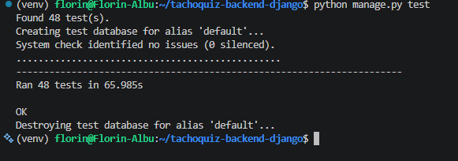
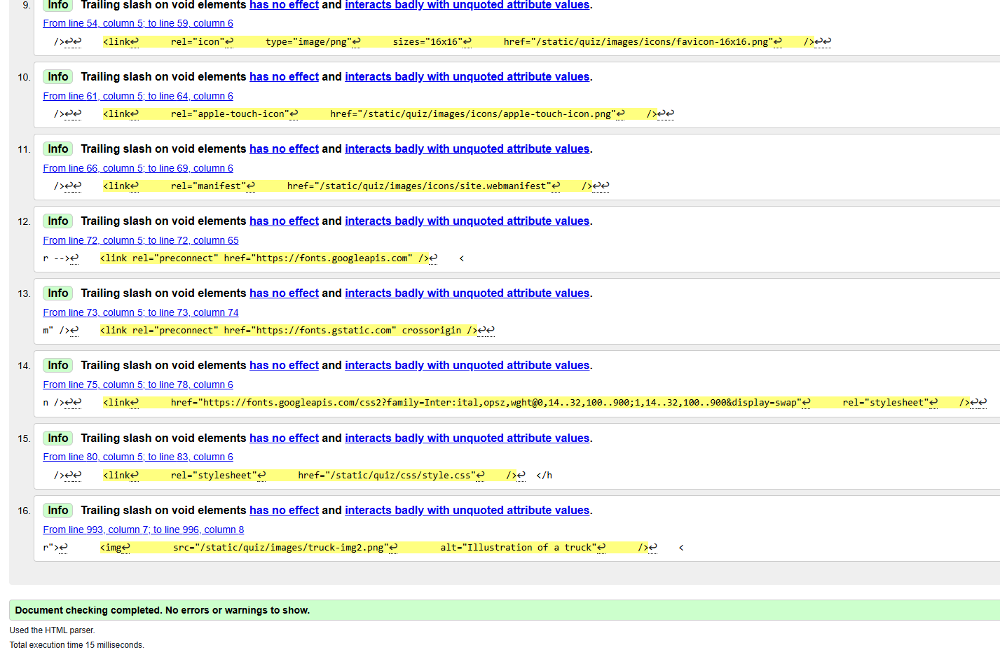
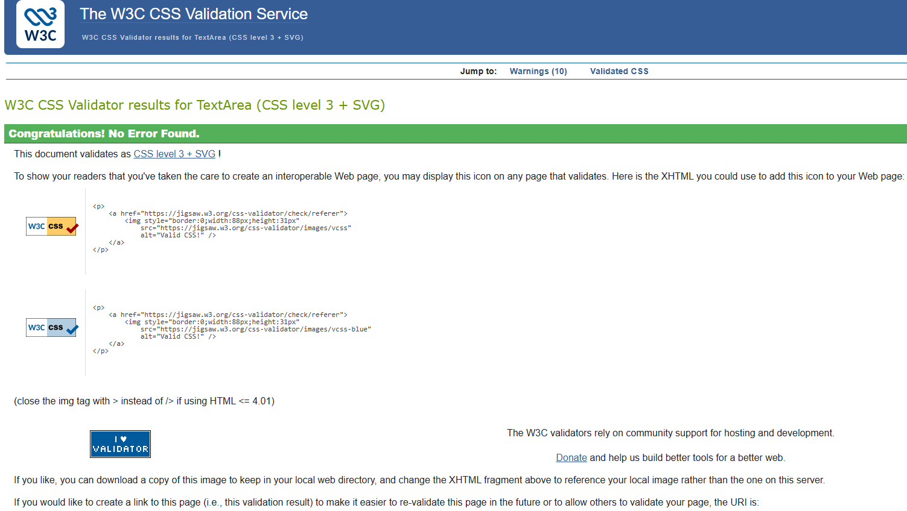
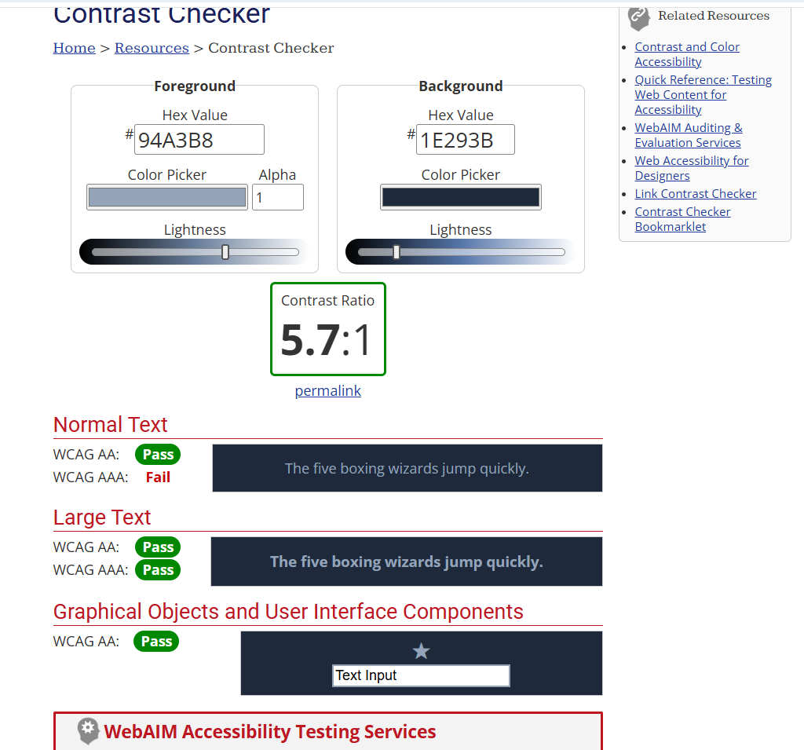
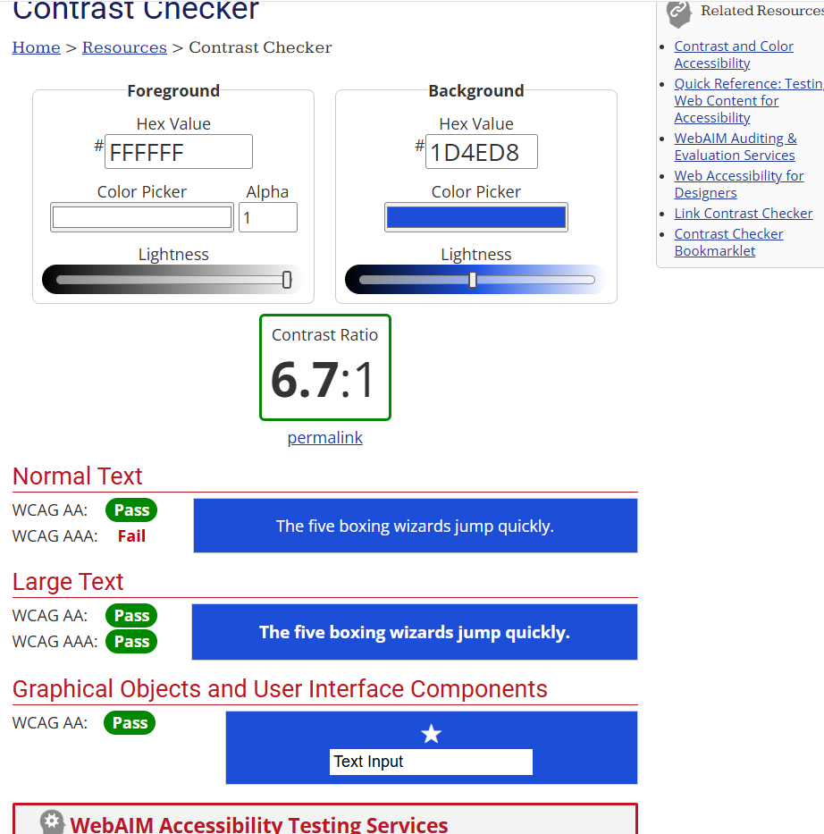
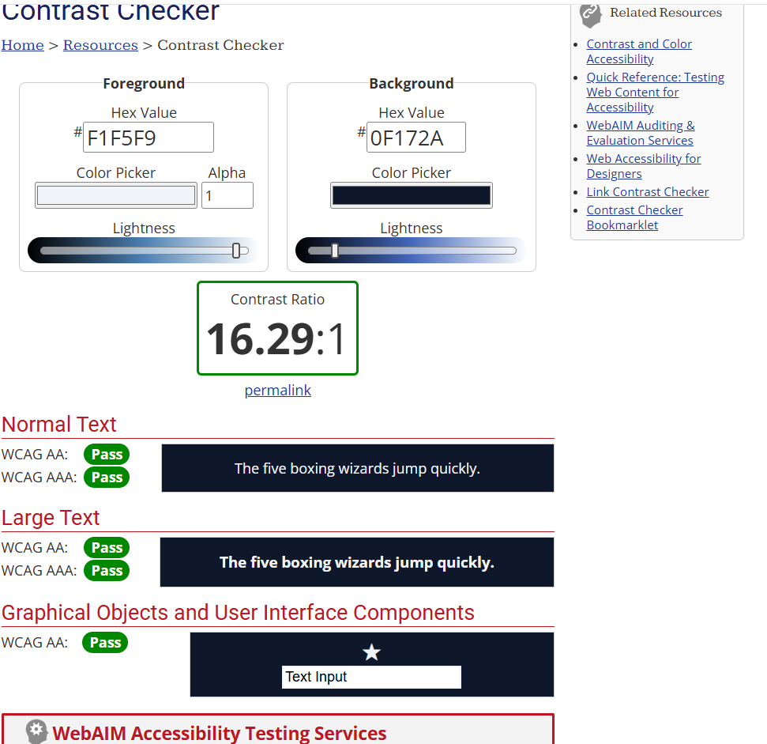
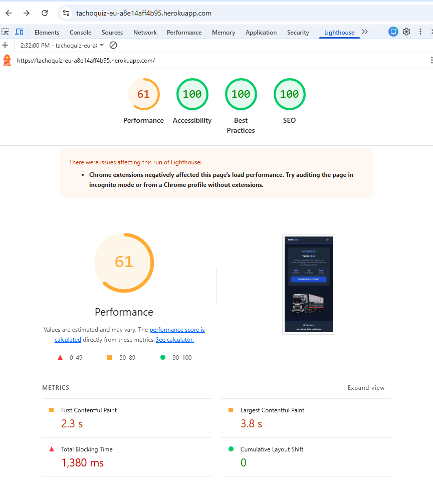
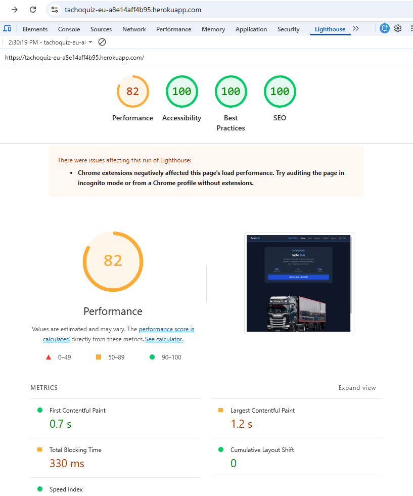

# TachoQuiz — Django Backend

TachoQuiz is a Django web application designed to help professional drivers practise tachograph rules, driving times, rest periods, and CPC-related knowledge.

This repository contains the Django backend and the integration of the existing frontend with Django. The application uses server-side authentication, database-driven quiz content, session-based quiz progression, score calculation, and persistent quiz result storage.

---

## Project Overview

TachoQuiz is being developed as a full-stack portfolio project using Django and PostgreSQL.

The project follows an Agile workflow based on 18 User Stories. Each major feature is developed on a separate Git branch, reviewed through a Pull Request, tested against its Acceptance Criteria, and merged into `main` when complete.

### Current Functionality

- User registration
- Login and logout
- Password reset
- Protected quiz functionality for authenticated users
- Dynamic quiz categories
- Database-driven questions and answers
- Randomised quiz question order
- One-question-at-a-time quiz progression
- Server-side answer validation
- Quiz score calculation
- Animated score display
- Persistent quiz result storage
- Django Admin quiz management

---

## Technologies Used

- **Python 3.12**
- **Django 6.1**
- **PostgreSQL**
- **psycopg 3.3.5**
- **python-decouple 3.8**
- **HTML5**
- **CSS3**
- **JavaScript**
- **Django Admin**
- **Git & GitHub**
- **Ubuntu / WSL**
- **VS Code**

### Planned Production Services

- **Cloudinary** — image and media management
- **DigitalOcean** — production deployment

---

## Project Structure

```text
tachoquiz-backend-django/
├── manage.py
├── requirements.txt
├── README.md
├── tachoquiz/
│   ├── settings.py
│   ├── urls.py
│   ├── asgi.py
│   └── wsgi.py
└── quiz/
    ├── migrations/
    ├── static/
    │   └── quiz/
    │       ├── css/
    │       ├── images/
    │       └── js/
    ├── templates/
    │   ├── quiz/
    │   └── tachoquiz/
    ├── admin.py
    ├── apps.py
    ├── forms.py
    ├── models.py
    ├── urls.py
    └── views.py
```

The `tachoquiz` directory contains project-level configuration.

The `quiz` application contains the quiz models, views, forms, URLs, templates, static files, and migrations.

---

## Database Design

Quiz content is stored in PostgreSQL and managed through Django models.

### Category

Stores the available quiz topics.

- `name`
- `slug`

### Question

Stores each quiz question and belongs to a category.

- `category` — ForeignKey to `Category`
- `text`
- `explanation`

### Answer

Stores the available answers for a question.

- `question` — ForeignKey to `Question`
- `text`
- `is_correct`

### QuizResult

Stores completed quiz attempts.

- `user` — ForeignKey to the authenticated user
- `category` — ForeignKey to `Category`
- `score`
- `total_questions`
- `completed_at`

The category relationship on saved results uses `SET_NULL` so historical attempts can remain available if a category is later removed.

---

# Completed User Stories

## US01 — Set Up Django Project

### User Story

As a developer, I want to set up the Django project so that I have a working backend foundation for the TachoQuiz application.

### Implementation

The Django project and `quiz` application were created, registered, and configured. Static files, environment variables, `.gitignore`, and the initial project structure were also established.

### Key Features

- Django project and `quiz` app
- `QuizConfig` registered in `INSTALLED_APPS`
- Project and application URL configuration
- Initial view and template
- Static file configuration
- Environment variables using `python-decouple`
- Sensitive `.env` file excluded from Git

**Status:** Completed

---

## US02 — Configure PostgreSQL Database

### User Story

As a developer, I want the application to use PostgreSQL so that the database is suitable for production deployment.

### Implementation

PostgreSQL was configured as the Django database using environment variables for database credentials. The connection was tested and Django migrations were applied successfully.

### Key Features

- PostgreSQL database and role
- Django PostgreSQL configuration
- `psycopg` database driver
- Database credentials stored in environment variables
- Successful migrations and database connection

**Status:** Completed

---

## US03 — Create Quiz Database Models

### User Story

As an administrator, I want quiz categories, questions, and answers stored in the database so that quiz content can be managed dynamically.

### Implementation

`Category`, `Question`, and `Answer` models were created with appropriate relationships and migrations.

### Key Features

- Category model
- Question model linked to Category
- Answer model linked to Question
- `related_name` relationships
- Human-readable `__str__()` methods
- Migrations created and applied

**Status:** Completed

---

## US04 — Configure Django Admin

### User Story

As an administrator, I want to manage quiz content through Django Admin so that I can add and update questions without modifying the source code.

### Implementation

Quiz models were registered with Django Admin, allowing quiz content to be created, edited, and deleted through the administration interface.

### Key Features

- Category management
- Question management
- Answer management
- Correct answer selection
- Editing and deletion of quiz content

**Status:** Completed

---

## US05 — User Registration

### User Story

As a visitor, I want to create an account so that I can access personalised functionality.

### Implementation

Registration was implemented using Django's `UserCreationForm`, extended with a required email field and integrated with the TachoQuiz UI.

### Key Features

- Username, email and password registration
- Required email field
- Django password validation
- Duplicate username validation
- Registration confirmation page
- Form error feedback

### Testing

- Valid registration succeeds
- Weak and mismatched passwords are rejected
- Duplicate usernames are rejected
- Invalid email input is rejected

**Status:** Completed

---

## US06 — User Authentication

### User Story

As a user, I want to log in and log out so that I can securely access personalised quiz functionality.

### Implementation

Authentication was implemented using Django's built-in authentication system and integrated with the shared site layout.

### Key Features

- Login using `authenticate()` and `login()`
- Logout using `logout()`
- Django messages after logout
- Dynamic navbar based on authentication state
- Consistent login and registration styling
- Authentication error handling

### Testing

- Valid login succeeds
- Invalid credentials display an error
- Logout ends the authenticated session
- Navbar updates correctly for logged-in and logged-out users

**Status:** Completed

---

## US07 — Display Quiz Categories

### User Story

As a user, I want to see available quiz categories so that I can choose the topic I want to practise.

### Implementation

Categories are retrieved dynamically from PostgreSQL using the Django ORM. Category URLs use slugs, and quiz functionality is protected for authenticated users.

### Key Features

- Dynamic category retrieval
- Question count using `Count()`
- Slug-based category URLs
- Empty category handling
- `@login_required` protection
- Django messages for unavailable categories

### Testing

- Categories load from PostgreSQL
- Correct question counts are displayed
- Category links open the correct quiz
- Empty categories cannot start a quiz
- Unauthenticated access redirects to Login

**Status:** Completed

---

## US08 — Start and Complete Quiz

### User Story

As a user, I want to complete a tachograph quiz so that I can test my knowledge.

### Implementation

Quiz progression uses Django sessions to preserve a randomised question order, selected answers, and the current question while the user completes the quiz one question at a time.

### Key Features

- Category-based quiz flow
- Randomised question order
- Session-based quiz state
- One question displayed at a time
- Server-side answer validation
- `Next` and `Submit Quiz` progression
- Post/Redirect/Get pattern
- Missing or expired session handling

### Testing

- Questions load from the database
- Question order is randomised
- Progress survives page refreshes
- Invalid or missing answers are rejected
- Refresh does not resubmit the previous answer
- Completed quizzes redirect to the score page

**Status:** Completed

---

## US09 — Display Quiz Score

### User Story

As a user, I want to see my quiz score after completing a quiz so that I can understand how well I performed.

### Implementation

Completed answers are evaluated server-side. Django calculates the correct and incorrect answer totals and score percentage, then displays the result on a dedicated score page.

### Key Features

- Server-side score calculation
- Correct and incorrect answer totals
- Total question count
- Score percentage
- Animated score progress bar
- Score feedback message
- Protected score page
- `PLAY AGAIN` functionality

### Testing

- Tested `0%`, partial, and `100%` scores
- Score calculations display correctly
- Score progress bar displays correctly
- `PLAY AGAIN` returns to categories
- Unauthenticated access is protected
- Missing completed quiz sessions are handled safely

**Status:** Completed

---

## Issue #30 — Forgot Password and Password Reset

### User Story

As a registered user, I want to reset my password if I forget it so that I can regain access to my TachoQuiz account.

### Implementation

Django's built-in password reset system was integrated with the existing authentication flow and TachoQuiz UI.

During development, reset emails are generated using Django's console mailer.

### Key Features

- `Forgot password?` link
- Password reset request form
- Secure reset token generation
- Reset email generation
- New password form
- Django password validation
- Reset completion page
- Invalid and expired link handling
- Account enumeration protection

### Testing

- Valid reset links work correctly
- Weak passwords are rejected
- Old password stops working after reset
- New password allows login
- Reused and invalid links are rejected
- Unknown email addresses do not reveal whether an account exists

**Status:** Completed

---

## US10 — Save Quiz Results

### User Story

As a registered user, I want my quiz results to be saved so that I can monitor my performance.

### Implementation

Completed quiz attempts are stored persistently in PostgreSQL using the `QuizResult` model.

Each result is associated with the authenticated user and category and stores the score, total number of questions, and completion time.

A session flag prevents duplicate records when the Score page is refreshed.

### Key Features

- `QuizResult` model
- User and category relationships
- Score and total question storage
- Automatic completion date/time
- Most-recent-first result ordering
- Duplicate result prevention
- Result retrieval through the Django ORM

### Testing

- Results are saved in PostgreSQL
- Correct user and category are stored
- Score and completion time are stored correctly
- Refreshing `/score/` does not create duplicates
- Saved attempts can be retrieved later using Django ORM queries

**Status:** Completed

---

## US11 — View Quiz History

### User Story

As a registered user, I want to view my previous quiz results so that I can track my progress.

### Implementation

A quiz history page was added to retrieve and display previous quiz attempts stored in PostgreSQL.

Results are filtered using the authenticated user, ensuring that each user can only access their own quiz history.

### Key Features

- Protected quiz history page
- Previous quiz attempts retrieved from PostgreSQL
- Category displayed for each attempt
- Score displayed for each attempt
- Completion date and time displayed
- Empty state for users with no previous results
- `START QUIZ` link from the empty history page
- History link added to the authenticated navbar
- Active page state added to navbar navigation
- User-specific result filtering

### Testing

- Authenticated users can access `/history/`
- Previous quiz attempts display correctly
- Category, score, date and time display correctly
- Users with no results see an appropriate empty state
- `START QUIZ` redirects to category selection
- Tested with multiple accounts to confirm users only see their own results
- Newly completed quizzes appear in the correct user's history
- Navbar History link and active page state work correctly

**Status:** Completed

---

# Testing

Development testing is performed throughout each User Story before merging into `main`.

Common project checks include:

```bash
python3 manage.py check
git diff --check
git status
```

Feature-specific testing includes:

- Authentication and access-control checks
- Form validation
- Database record creation and retrieval
- Session behaviour
- Quiz progression
- Score calculations
- Invalid and missing data handling
- Refresh and duplicate-submission behaviour
- Password reset security checks

Acceptance Criteria are verified before a User Story is marked complete.

---

## US12 — Integrate Existing Frontend With Django

### Description

As a developer, I want to integrate the existing TachoQuiz frontend with Django so that the original interface works with the new backend.

### Implementation

The existing HTML, CSS and JavaScript frontend was adapted to work with Django templates, database-driven content and server-side quiz functionality.

The original visual design was preserved where appropriate while legacy frontend logic was replaced by Django functionality.

Key changes included:

- Integrated the original hero design into the Django home page
- Updated the category interface to use categories stored in PostgreSQL
- Preserved the existing quiz and score interface
- Integrated authentication and quiz history pages with the shared design
- Used Django template inheritance through `base.html`
- Loaded CSS, JavaScript, images and icons using Django static files
- Retained JavaScript for:
  - responsive navbar behaviour
  - quiz answer selection
  - score progress bar animation
- Removed legacy frontend CSS that was no longer required
- Removed redundant static files configuration
- Replaced obsolete frontend/localStorage behaviour with Django URLs, sessions and database-driven functionality

### Testing

- Confirmed Home, Categories, Quiz, Score and History pages display correctly
- Confirmed authentication and password reset pages remain functional
- Confirmed CSS, JavaScript, images and icons load correctly
- Confirmed Django can locate static assets using `findstatic`
- Confirmed navbar and mobile hamburger functionality
- Confirmed quiz answer selection and score progress bar JavaScript
- Confirmed desktop and mobile layouts
- Confirmed `python3 manage.py check` reports no issues

---

## Improve Quiz Content Management

### Description

As an administrator, I want to manage and bulk import quiz content efficiently so that I can add large numbers of questions without manually creating every question and answer separately.

The quiz content management system was improved using Django Admin Inlines and a custom CSV import management command.

This makes it possible to manage individual questions through Django Admin while also providing a faster way to import larger sets of quiz questions.

### Implementation Summary

Django Admin was improved so that answers can be managed directly from the Question admin page.

A custom Django management command was also created to import structured quiz content from CSV files into the database.

The importer validates the CSV data before creating database records and prevents duplicate questions from being created when the same file is imported again.

### What Was Added

- Improved Django Admin configuration for quiz content.
- Answer management using Django Admin Inlines.
- Four answer fields available directly from the Question admin page.
- Question explanations editable alongside the question.
- Existing `is_correct` field used to identify the correct answer.
- Structured CSV format for quiz content.
- Custom Django management command:
  - `import_questions`
- CSV validation for:
  - category
  - question
  - explanation
  - four answers
  - correct answer
- Automatic category lookup and creation.
- Automatic creation of questions and related answers.
- Automatic correct-answer mapping.
- Duplicate question protection.
- Database transactions for safe imports.
- Error handling for missing CSV files.

### CSV Structure

Quiz content can be stored using the following CSV structure:

```csv
category,question,explanation,answer_1,answer_2,answer_3,answer_4,correct_answer
Driving Times,What is the normal daily driving limit?,The normal daily driving limit is 9 hours.,8 hours,9 hours,10 hours,11 hours,2
Rest Periods,What is the normal daily rest period?,The normal daily rest period is 11 hours.,8 hours,9 hours,10 hours,11 hours,4
```
---

## US13 — Add Cloudinary Image Management

### Description

As an administrator, I want application images managed through Cloudinary so that media files are stored and delivered independently from the application server.

### Implementation Summary

Cloudinary was integrated with Django to provide external media storage for uploaded application images.

Category images can now be uploaded through Django Admin, stored in Cloudinary and displayed dynamically through Django templates.

### What Was Added

- Installed:
  - `cloudinary`
  - `django-cloudinary-storage`
  - `Pillow`
- Added Cloudinary configuration using environment variables
- Added Cloudinary media storage through Django `STORAGES`
- Added an optional `image` field to the `Category` model
- Added database migration for category images
- Added category image uploads through Django Admin
- Added category image display in Django templates
- Added responsive category image styling
- Removed unused legacy category selection styles

### How It Works

1. An administrator uploads an image through Django Admin.
2. Django processes the image using `ImageField`.
3. Django's default media storage uses `MediaCloudinaryStorage`.
4. The image is uploaded to Cloudinary.
5. PostgreSQL stores the image reference.
6. Django templates access the image using:

   ```django
   {{ category.image.url }}
   ```

---

## Deployment

Tacho Quiz is deployed on Heroku in the EU region.

The production application uses:

- **Heroku** for hosting
- **Heroku Postgres** for the production database
- **Gunicorn** as the production WSGI server
- **WhiteNoise** for static files
- **Cloudinary** for media storage
- **Python 3.12**

Sensitive configuration is stored using Heroku Config Vars and is not committed to GitHub.

The following environment variables are configured:

```text
ALLOWED_HOSTS
CLOUDINARY_API_KEY
CLOUDINARY_API_SECRET
CLOUDINARY_CLOUD_NAME
DATABASE_URL
DEBUG
SECRET_KEY
```

The `Procfile` runs database migrations automatically before each release and starts the application using Gunicorn:

```text
release: python manage.py migrate --noinput
web: gunicorn tachoquiz.wsgi
```

A Django fixture (`quiz/fixtures/quiz_data.json`) is used to populate the production database with the initial quiz content.

The deployed application was tested successfully for authentication, quiz functionality, quiz history, PostgreSQL, Cloudinary media, static files, and English/Romanian translations.

### Known Limitations

Password reset email delivery is currently disabled for the assessment deployment. A production email provider will be configured before a future public release.

---

## Bilingual Quiz Content

The Tacho Quiz dataset was expanded to provide complete quiz content in both English and Romanian.

### What Was Added

- 13 quiz categories
- 192 questions
- 768 answer options
- 4 answers per question
- English and Romanian questions, answers and explanations
- 12 scenario-based Study Cases
- CSV-based quiz content stored in `quiz/data/questions.csv`
- Custom Django management command for importing quiz content
- Quiz History support for the bilingual categories

The dataset was validated locally and successfully deployed and tested on Heroku in both English and Romanian.

### UX Improvement

The `Score` link was removed from the navigation bar because the score page is only required after completing a quiz. Previous results remain available through Quiz History.


# Bugs & Development Challenges

The following are some of the most relevant issues encountered during development.

### Template Inheritance

Authentication templates initially contained duplicated document structure. Child templates were updated to extend the shared `base.html` layout.

### Static File Configuration

CSS initially failed to load because the required static file configuration was missing. Django static settings were corrected.

### Category URL Resolution

A `NoReverseMatch` error occurred because a template URL name did not match `urls.py`. The `category-quiz` URL name was applied consistently.

### Quiz Progress Reset

The quiz initially restarted and re-randomised questions on every GET request. Session initialisation was changed so active quiz progress is preserved.

### Form Re-submission on Refresh

Rendering the next question directly after POST could resubmit the previous answer when the browser refreshed. The Post/Redirect/Get pattern was implemented.

### Missing Quiz Session

Missing or expired quiz session data could lead to incorrect navigation. Session validation now redirects users safely to the categories page.

### Score Progress Bar

The score percentage was calculated correctly, but the progress bar initially lacked the required CSS. Styling was added and the dynamic width is applied through JavaScript using a `data-percentage` attribute.

### Authentication Redirect

Protected views required `LOGIN_URL` configuration so unauthenticated users are redirected to the correct Login page.

### Registration Validation Feedback

Django returned registration errors correctly, but invalid fields were not visually clear. Error styling was added to highlight invalid inputs.

### Django 6.1 Email Configuration

The password reset setup initially caused an `ImproperlyConfigured` error when deprecated email configuration was used alongside `MAILERS`. The project was updated to use the Django 6.1 mailer configuration.

### Quiz History Navigation State

After adding the History page to the navbar, the current page was not visually highlighted because the existing CSS `:active` pseudo-class only applies while a link is being clicked.

Django's `request.resolver_match.url_name` was used to add an `.active` class to the current navigation link, allowing the active page to remain visually highlighted.

### US12 — Frontend Integration

- **Duplicate static file discovery:**  
  Static assets were being discovered twice because the app-level `static` directory was also manually included in `STATICFILES_DIRS`. The redundant setting was removed after confirming Django's `AppDirectoriesFinder` correctly discovers the files.

- **Legacy frontend styles:**  
  Several CSS rules from the original JavaScript/localStorage frontend were no longer used after the Django integration. Unused styles were removed while preserving classes required by the current templates and JavaScript.

- **Registration confirmation navigation:**  
  The account confirmation page originally linked users back to the Home page using a `Start Quiz` button even though newly registered users were not automatically authenticated. The flow was updated to direct users to Login first.


### US13 — Cloudinary Image Management

- **ImageField required Pillow:**  
  Django raised `fields.E210` when the category image field was added because Pillow was not installed. Pillow was added to the project dependencies.

- **Cloudinary upload permission error:**  
  An API key with insufficient media permissions caused Cloudinary to reject uploads with a `NotAllowed` error. A suitable API key with upload permissions was configured.

- **Cloudinary storage verification:**  
  The integration was verified by confirming Django's default storage resolves to `MediaCloudinaryStorage` and that uploaded category images appear in Cloudinary Media Library.

---

# Security

The project currently includes the following security practices:

- Django's built-in authentication system
- Django password validation
- CSRF protection on POST forms
- `@login_required` on protected quiz views
- Environment variables for sensitive configuration
- `.env` excluded from version control
- Server-side answer validation
- Secure Django password reset tokens
- Password reset responses that do not reveal whether an account exists

Production-specific security settings will be completed as part of deployment.

---

# Deployment

Production deployment is planned for **DigitalOcean** with **PostgreSQL** as the production database.

**Cloudinary** is planned for image and media management.

Production deployment configuration has not yet been completed and will be documented when the relevant User Stories are implemented.

---

# Future Development

The project is being developed sequentially according to the remaining User Stories.

Planned functionality includes:

- User result history and performance monitoring
- Additional quiz and user experience improvements
- Production media configuration with Cloudinary
- DigitalOcean deployment
- Production email delivery for password reset

This section will be updated as the remaining User Stories are completed.

---

# Development Workflow

The project follows an Agile-inspired GitHub workflow:

1. Create or select a GitHub Issue for the User Story.
2. Review its Acceptance Criteria.
3. Create a dedicated feature branch.
4. Implement the feature incrementally.
5. Make small, meaningful Git commits.
6. Test the Acceptance Criteria.
7. Run final Django and Git checks.
8. Push the feature branch.
9. Open a Pull Request.
10. Review and merge into `main`.
11. Delete the completed feature branch.

Detailed implementation history is available through the repository's GitHub Issues, commits, and Pull Requests.

---

## Images
[truck driving time](https://unsplash.com/photos/a-white-semi-truck-driving-down-a-rural-road-ZhNYKwjRMh4)
[truck driver rest](https://unsplash.com/photos/parked-trucks-kGoPcmpPT7c)
[calendar rest](https://unsplash.com/photos/a-calendar-with-red-push-buttons-pinned-to-it-bwOAixLG0uc)
[coffee break](https://unsplash.com/photos/a-yellow-coffee-trailer-parked-next-to-a-car-9SwAWAvRQsg)
[working time](https://unsplash.com/photos/pink-bell-alarm-clock-showing-210-I84vGUYGUtQ)
[tachograph](https://en.wikipedia.org/wiki/Digital_tachograph)
[driver records](https://chatgpt.com/s/m_6aafe465e1788191864b6b4f80d7491e)
[two truck drivers](https://unsplash.com/photos/two-red-and-green-semi-trucks-parked-at-road-16CrZmN9l60)
[truck ferry](https://unsplash.com/photos/a-group-of-cars-parked-on-a-road-next-to-a-body-of-water-RT1a-NTfp2k)
[road emergency](https://unsplash.com/photos/a-couple-of-trucks-that-are-sitting-in-the-street-_mv4_eYTXeY)
[road enforcement](https://commons.wikimedia.org/wiki/File:Speed_enforcement_camera_road_sign_%27ACHTUNG_RADARKONTROLLE%27_01.jpg)
[quiz study](https://unsplash.com/photos/aerial-photography-of-freight-truck-lot-GOD2mDNujuU)
---

## Testing

### Automated Testing

Automated testing was carried out using Django's built-in testing framework.

The test suite covers the application's models, authentication system,
quiz functionality, scoring, user results, and an important end-to-end
user journey.

The tests are organised into separate files according to the functionality
being tested:

- `test_models.py` — model creation, relationships, validation and localisation
- `test_authentication.py` — registration, login, logout and protected views
- `test_quiz.py` — quiz categories, questions, answers and quiz progression
- `test_scoring.py` — quiz completion and score calculation
- `test_results.py` — saving and displaying quiz results
- `test_user_journeys.py` — complete user journey through the application

The complete test suite can be run with:

`python manage.py test`

Final automated test result:

- **48 tests executed**
- **48 tests passed**
- **0 failures**
- **0 errors**

This confirms that the tested backend functionality behaves as expected.



### Manual Testing

Manual testing was carried out to verify the main functionality of the
application from a user's perspective.

The application was tested in both English and Romanian where relevant.

| # | Test | Expected Result | Result |
|---|---|---|---|
| 1 | Open registration page | Registration page loads correctly | PASS |
| 2 | Register with valid details | User account is created successfully | PASS |
| 3 | Login with invalid credentials | Error message is displayed | PASS |
| 4 | Login with valid credentials | User is authenticated successfully | PASS |
| 5 | Access quiz while logged out | User is redirected to the login page | PASS |
| 6 | Logout | User is logged out successfully | PASS |
| 7 | Access protected page after logout | User is redirected to the login page | PASS |
| 8 | Login after protected-page redirect | User returns to the intended quiz area | PASS |
| 9 | Open categories page | All 13 quiz categories are displayed | PASS |
| 10 | Start a category quiz | Quiz starts successfully | PASS |
| 11 | Display a question | Exactly four answer options are displayed | PASS |
| 12 | Continue without selecting an answer | User cannot continue without answering | PASS |
| 13 | Select an answer | Selected answer is recorded | PASS |
| 14 | Submit an answer | Question explanation is displayed | PASS |
| 15 | Try to change submitted answer | Submitted answer cannot be changed | PASS |
| 16 | Continue to next question | Next question is displayed | PASS |
| 17 | Complete all questions | Quiz completes and redirects to the score page | PASS |
| 18 | View score | Correct, incorrect, total and percentage results are displayed | PASS |
| 19 | View quiz history | Completed quiz result appears in the user's history | PASS |
| 20 | Start another quiz | A new quiz session is created correctly | PASS |
| 21 | Open navigation on mobile | Hamburger navigation is displayed and works | PASS |
| 22 | Use navigation on mobile | Navigation links work correctly | PASS |
| 23 | Logout on mobile | Logout works correctly | PASS |
| 24 | Change language on mobile | English/Romanian language switching works | PASS |
| 25 | Complete quiz on mobile | Quiz remains usable without horizontal scrolling | PASS |
| 26 | View score on mobile | Score page displays correctly | PASS |
| 27 | Test tablet layout | Layout displays correctly around 768px | PASS |
| 28 | Test desktop layout | Layout displays correctly at 1024px and above | PASS |
| 29 | Display longer Romanian content | Longer translated text remains readable and usable | PASS |
| 30 | Resize/orient the viewport | Layout remains responsive and usable | PASS |

Final manual testing result:

- **30 tests completed**
- **30 tests passed**
- **0 failed**

---

### HTML Validation

The rendered HTML output of the application's main pages was validated
using the W3C Nu HTML Checker.

| Page | Result |
|---|---|
| Home | PASS - No errors or warnings |
| Register | PASS - No errors or warnings |
| Login | PASS - No errors or warnings |
| Categories | PASS - No errors or warnings |
| Quiz | PASS - No errors or warnings |
| Score | PASS - No errors or warnings |
| Quiz History | PASS - No errors or warnings |

During HTML validation, an unclosed `<span>` element was identified in
the Romanian translation of the home page.

The translation was corrected and Django translation messages were
recompiled using:

`python manage.py compilemessages`

The page was then revalidated successfully with no errors or warnings.


---

### CSS Validation

The application's CSS was validated using the W3C CSS Validator.

The final validation completed successfully with:

- **0 CSS errors**


---

### Accessibility and Colour Contrast

Accessibility was tested using Lighthouse and the WebAIM Contrast Checker.

During Lighthouse testing, insufficient colour contrast was identified
for some secondary text and action button elements.

The affected colours were adjusted and the CSS specificity of the action
button styles was corrected.

Additional manual colour contrast testing was then carried out using
WebAIM.

| Foreground | Background | Result |
|---|---|---|
| `#94A3B8` | `#1E293B` | WCAG AA PASS |
| `#FFFFFF` | `#1D4ED8` | WCAG AA PASS |
| `#F1F5F9` | `#0F172A` | WCAG AA PASS |
| `#64748B` | `#0F172A` | WCAG AA FAIL - before fix |
| `#94A3B8` | `#0F172A` | WCAG AA PASS - after fix |

The original `--color-text-dim` value of `#64748B` produced insufficient
contrast for normal-sized text against the main `#0F172A` background.

It was therefore changed to `#94A3B8` and retested successfully.



---

### Lighthouse Testing

Lighthouse testing was carried out against the deployed Heroku application
after the final accessibility and performance improvements.

| Category | Mobile | Desktop |
|---|---:|---:|
| Performance | 72 | 82 |
| Accessibility | 100 | 100 |
| Best Practices | 100 | 100 |
| SEO | 100 | 100 |

The application achieved full scores for Accessibility, Best Practices
and SEO on both Mobile and Desktop tests.

Performance results were lower on the deployed Heroku environment.
Lighthouse identified areas such as JavaScript execution, render-blocking
resources, font loading and caching as possible areas for future
optimisation.

These performance findings do not prevent the application's core
functionality from operating correctly and can be addressed as future
optimisation work.




---

### Image Optimisation

Lighthouse initially identified the main hero image as a significant
performance opportunity.

The original PNG image was resized and converted to WebP:

- Original format: PNG
- New format: WebP
- Optimised dimensions: 760 × 507 pixels
- Optimised file size: approximately 39 KB

This significantly reduced the size of the main hero image while
maintaining suitable visual quality.

---

### Bugs Found and Fixed During Testing

Several issues were identified and corrected during US17 testing.

| Issue | Fix | Retest Result |
|---|---|---|
| Login `next` parameter could accept an unsafe external redirect | Added `url_has_allowed_host_and_scheme()` validation | PASS |
| Logout was accessible using a GET request | Changed logout to POST-only with CSRF protection and `@require_POST` | PASS |
| Score link in the navbar could be accessed without a completed quiz | Removed the Score link from the main navigation | PASS |
| Romanian home translation contained an unclosed `<span>` element | Corrected the translation and recompiled messages | PASS |
| Lighthouse identified insufficient colour contrast | Updated affected text/button colours and CSS specificity | PASS |
| WebAIM identified `#64748B` as insufficient for normal text | Changed `--color-text-dim` to `#94A3B8` | PASS |
| Main hero PNG was unnecessarily large | Resized and converted the image to WebP | PASS |
| New WebP asset caused a stale WhiteNoise static manifest during testing | Rebuilt static files using `collectstatic` | PASS |

After the fixes were applied, the complete Django automated test suite
was run again:

- **48 tests passed**
- **0 failures**
- **0 errors**

---

### Testing Summary

US17 testing covered automated backend testing, manual functional testing,
responsive design, HTML and CSS validation, accessibility, colour contrast,
performance and important user journeys.

Final results:

- **48 / 48 automated tests passed**
- **30 / 30 manual tests passed**
- **HTML validation passed**
- **CSS validation passed**
- **WCAG AA colour contrast issues identified and corrected**
- **Lighthouse Accessibility: 100**
- **Lighthouse Best Practices: 100**
- **Lighthouse SEO: 100**
- **Application successfully deployed and tested on Heroku**
---

# Author

**Florin Albu**

TachoQuiz is being developed as a full-stack web development portfolio project.


---